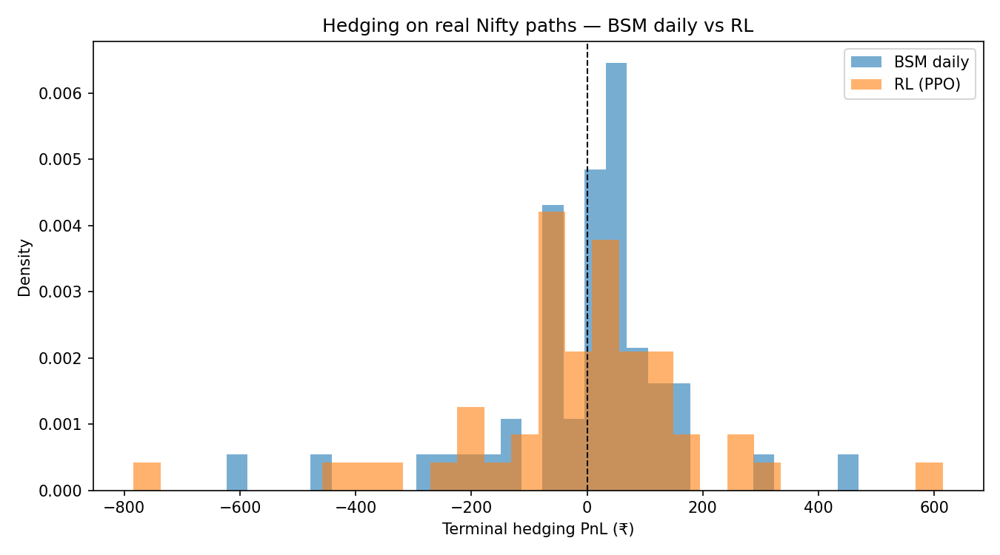
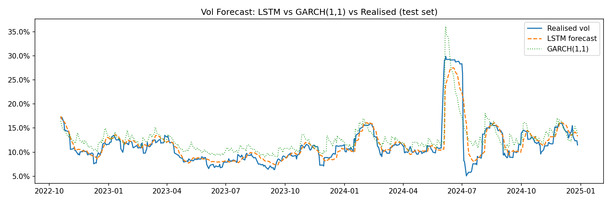

# Delta Hedging under Stochastic Volatility

This repository studies delta hedging for short-dated Nifty 50 call options under transaction costs and time-varying volatility. It combines stochastic-calculus baselines, LSTM volatility forecasting, PPO-based reinforcement learning, real-path backtesting, and mixed analytic-learning controllers.

The central empirical finding is that the best-performing method is not stand-alone RL, but a structured hybrid:

```text
Partial-BSM-LSTM(alpha=0.90, theta=0.10)
```

This model uses:

- a BSM delta target
- an LSTM volatility forecast
- partial, thresholded execution to reduce over-trading

Across the saved real-path backtests, this hybrid outperforms base BSM, BSM-LSTM, and all RL variants evaluated in the repository.

## Quick Links

- Full Report: [report/Report.pdf](report/Report.pdf)
- Short Report: [report/short_report.pdf](report/short_report.pdf)
- Data, Saved Models, Figures and Results: [Google Drive folder](https://drive.google.com/drive/folders/1BrRk93y8Up_0tuA_svg3kWJIxfsxjnar?usp=sharing)

## Abstract

Discrete delta hedging is difficult in practice because trading is not continuous, transaction costs make frequent rebalancing expensive, and volatility is unknown and time-varying. This project asks whether reinforcement learning can improve on analytic Black-Scholes-Merton hedging in that setting. The answer from the experiments in this repository is largely no: analytic structure remains dominant, and better volatility inputs help more than end-to-end learned hedge policies. A two-layer LSTM improves volatility estimation relative to GARCH, but simple realized-volatility persistence is still a strong baseline. On real Nifty paths, BSM with LSTM volatility outperforms PPO-based hedgers, and the best overall result comes from a deterministic mixed controller that partially adjusts toward the BSM-LSTM target. The main lesson is that structure plus better inputs plus simple cost-aware execution beats complex stand-alone RL in this setting.

## Main Results

### Best real-path model

From the saved real-path backtests generated by `scripts/run_anchor_models.py`:

- `Partial-BSM-LSTM(alpha=0.90, theta=0.10)`: MAE `88.27`
- `BSM-LSTM`: MAE `96.11`
- `BSM daily (rv21 sigma)`: MAE `105.07`
- `RL PPO baseline (rv21 sigma)`: MAE `137.49`

See the tracked summary figure:



### Real-path comparison

From the saved real-path comparison generated by `scripts/run_backtests.py`:

- `BSM daily (rv21 sigma, real paths)`: MAE `105.0650`
- `RL PPO baseline (rv21 sigma, real paths)`: MAE `137.4886`
- `BSM daily (LSTM sigma, real paths)`: MAE `96.1121`
- `RL PPO (LSTM sigma, real paths)`: MAE `168.2116`
- `Hybrid (BSM-LSTM low/mid, DR-RL high)`: MAE `100.0227`

Interpretation:

- base BSM beats base PPO on real Nifty paths
- replacing `rv21` with LSTM sigma improves the analytic hedge
- giving PPO the LSTM sigma setup does not close the gap
- the best improvement comes from controlling execution around the analytic target


### Forecasting takeaway

From the saved forecasting evaluation generated by `scripts/run_p3.py`:

- LSTM MAE: `0.0114`
- GARCH MAE: `0.0194`
- rv21 persistence MAE: `0.0043`
- India VIX MAE: `0.0344`

Interpretation:

- the LSTM improves materially over GARCH and India VIX
- at the 21-day horizon, simple realized-volatility persistence is still very strong
- the useful volatility improvement in this repo comes from using the LSTM forecast as an input to the hedge, not from expecting it to dominate every baseline



## Method Overview

The project is structured into five parts.

### Part I: base RL delta hedging

This stage compares PPO-based hedging against analytic BSM hedging under a GBM environment with transaction costs. It establishes the baseline fact that under clean GBM dynamics, BSM is already hard to beat.

Main script:

- [scripts/run_p1.py](scripts/run_p1.py)

Key outputs:

This script writes local outputs under `results/` and `models/`, which are ignored by Git.

### Part II: novel RL experiments

This stage explores six RL variants motivated by stochastic-calculus considerations:

- Itô-style reward shaping
- Heston stochastic-volatility training environments
- gamma-aware observations
- domain-randomized sigma training

Main script:

- [scripts/run_novel.py](scripts/run_novel.py)

Key outputs:

This script writes local outputs under `results/` and `models/`, which are ignored by Git.

Despite these extensions, the later real-path results still favor analytic and hybrid methods.

### Part III: LSTM volatility forecasting and pricing

This stage trains a two-layer stacked LSTM on Nifty features to predict 21-day forward realized volatility. It also benchmarks the resulting volatility inputs inside an option-pricing horse race.

Main script:

- [scripts/run_p3.py](scripts/run_p3.py)

Key outputs:

This script writes local outputs under `data/processed/`, `models/`, and `results/`, which are ignored by Git.

### Part IV: LSTM-RL integration

This stage trains a PPO agent in an environment where episode volatility is drawn from the empirical distribution of saved LSTM forecasts. It tests whether better volatility conditioning can rescue RL performance.

Main script:

- [scripts/run_integration.py](scripts/run_integration.py)

Key outputs:

This script writes local outputs under `results/` and `models/`, which are ignored by Git.

Result:

- `LSTM-guided BSM delta`: MAE `0.2268`
- `RL (constant sigma)`: MAE `0.8275`
- `RL (LSTM sigma)`: MAE `0.8897`

So the LSTM signal helps the analytic hedge more than the learned hedge policy.

### Part V: real-path backtesting

This stage evaluates the saved models on 51 non-overlapping 21-day windows from the real Nifty validation-plus-test period.

Main script:

- [scripts/run_backtests.py](scripts/run_backtests.py)

Key outputs:

This script writes local outputs under `results/`, which is ignored by Git.

This is the most important evaluation stage in the repository.

### Mixed-model and anchor-controller sweep

This stage explores whether RL can help if it is constrained to act around a BSM target rather than replacing the target from scratch. It includes PPO anchor controllers, discrete DQN controllers, and deterministic partial-adjustment rules.

Main script:

- [scripts/run_anchor_models.py](scripts/run_anchor_models.py)

Key outputs:

This script writes local outputs under `results/` and `models/`, which are ignored by Git.

This is where the best model in the repository, `Partial-BSM-LSTM(alpha=0.90, theta=0.10)`, is identified.

## Repository Structure

### Source code

- [src/bsm.py](src/bsm.py): BSM pricing, Greeks, CRR tree, implied volatility
- [src/env.py](src/env.py): base GBM hedging environment
- [src/heston_env.py](src/heston_env.py): stochastic-volatility environment
- [src/lstm_model.py](src/lstm_model.py): LSTM model and training code
- [src/data_pipeline.py](src/data_pipeline.py): feature engineering and data preparation
- [src/backtest.py](src/backtest.py): evaluation and bootstrap analysis
- [src/baselines.py](src/baselines.py): analytic hedging baselines
- [src/anchor_env.py](src/anchor_env.py): anchor-controller environments
- [src/pricing_pipeline.py](src/pricing_pipeline.py): pricing experiments

### Scripts

- [scripts/run_all.py](scripts/run_all.py): full end-to-end runner
- [scripts/run_p1.py](scripts/run_p1.py): Part I
- [scripts/run_novel.py](scripts/run_novel.py): Part II
- [scripts/run_p3.py](scripts/run_p3.py): Part III
- [scripts/run_integration.py](scripts/run_integration.py): Part IV
- [scripts/run_backtests.py](scripts/run_backtests.py): Part V
- [scripts/run_anchor_models.py](scripts/run_anchor_models.py): mixed-model sweep
- [scripts/build_report_figures.py](scripts/build_report_figures.py): figure assembly for the reports

### Artifacts

- `report_figures/`: curated figures used in the reports
- `report/`: compiled PDFs included with the repository
- `notebooks/`: exploratory notebooks tracked in the repository

## File Tree

```text
.
├── README.md
├── requirements.txt
├── setup.sh
├── report.tex
├── report_short.tex
├── report/
│   ├── Report.pdf
│   └── short_report.pdf
├── src/
│   ├── bsm.py
│   ├── env.py
│   ├── heston_env.py
│   ├── lstm_model.py
│   ├── data_pipeline.py
│   ├── pricing_pipeline.py
│   ├── baselines.py
│   ├── backtest.py
│   ├── anchor_env.py
│   └── nse_options.py
└── scripts/
    ├── run_all.py
    ├── run_p1.py
    ├── run_novel.py
    ├── run_p3.py
    ├── run_integration.py
    ├── run_backtests.py
    ├── run_anchor_models.py
    ├── build_report_figures.py
    └── plot_flow_diagram.py
```

## Setup

### Recommended setup

```bash
bash setup.sh
conda activate scaf
```

### Manual setup

```bash
python -m venv .venv
source .venv/bin/activate
pip install -r requirements.txt
```

The current [requirements.txt](requirements.txt) is aligned with the scripts and includes the numerical stack, RL libraries, `arch`, `requests`, `pyarrow`, and `jupyter`.

### Notes

- some scripts may refresh market data using `yfinance`
- running the full pipeline will create local `data/`, `models/`, and `results/` directories if they are absent
- LaTeX compilation requires a separate TeX installation

## Reproducibility

### Full pipeline

```bash
python scripts/run_all.py
```

This executes:

1. `run_p3.py`
2. `run_p1.py`
3. `run_integration.py`
4. `run_novel.py`
5. `run_backtests.py`
6. `build_report_figures.py`

### Recommended staged run

```bash
python scripts/run_p3.py
python scripts/run_p1.py
python scripts/run_integration.py
python scripts/run_novel.py
python scripts/run_backtests.py
python scripts/run_anchor_models.py
python scripts/build_report_figures.py
```

### Fast path to the headline result

```bash
python scripts/run_backtests.py
python scripts/run_anchor_models.py
```

Then inspect the regenerated files under `results/` locally, and compare them with the tracked summaries in [report_short.tex](report_short.tex) and [report/short_report.pdf](report/short_report.pdf).

## Generated Outputs

Running the training and evaluation scripts creates local artifacts under:

- `data/`
- `models/`
- `results/`

These directories are ignored by Git. The reports and tracked figures summarize the expected outputs, while the raw experiment files are meant to be regenerated locally.

If you want the generated artifacts without rerunning the pipeline, use:

- [Google Drive artifact folder](https://drive.google.com/drive/folders/1BrRk93y8Up_0tuA_svg3kWJIxfsxjnar?usp=sharing)

## Reports And Figures

- Full report source: [report.tex](report.tex)
- Short report source: [report_short.tex](report_short.tex)

To compile locally:

```bash
pdflatex report.tex
pdflatex report_short.tex
```

## Caveats

- training is time-consuming; several RL scripts run for hundreds of thousands to one million timesteps
- `rv21` is a very strong 21-day volatility baseline because of persistence and overlap, so improvements over it should be interpreted carefully
- `run_integration.py` currently uses saved train and test LSTM predictions to form its volatility pool; for stricter separation you may prefer a train-only or train-plus-validation pool
- the strongest result in the repository is a deterministic mixed controller, not an RL policy

## One-Sentence Summary

In this repository, analytic structure plus better volatility inputs plus simple cost-aware execution beats stand-alone RL for delta hedging on real Nifty paths.
